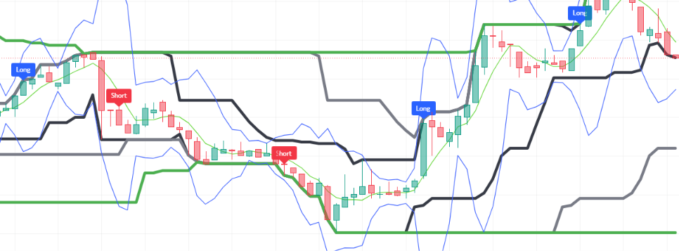

# Pine-Script-Shift-Zone-Based-Indicator
Indicator combining stateful RSI momentum shift zone triggers (with refractory cooldown locks), 3-tiered Donchian Price Channels (9, 26, 52), dynamic gradient color-mapping, and extreme 4-sigma Bollinger Bands. Signals entry for Long and Short momentum shifts directly on TradingView charts.
--
## Chart Preview

--
## Motivation & Problem
- **Oscillator Re-Trigger Spam & Extreme Volatility Whipsaws**: Conventional overbought/oversold oscillator strategies suffer from signal spamming when momentum lingers in extreme zones, repeatedly triggering false entries without giving trades room to develop.
- **The Core Goal**: To engineer a stateful "Shift Zone" indicator (SZB) that captures explosive RSI boundary breakthroughs (70 crossover / 30 crossunder) and locks out redundant triggers across a minimum bar duration, while mapping price within nested Donchian channels and 4-sigma Bollinger Bands.
--
## Strategy Logic & Architecture
- This indicator identifies momentum regime shifts and volatility expansion by utilizing a **rule-based, state-locked filtering system**:
### Core Components:
1. **RSI Shift Zone Detection & Stateful Cooldown Lock**:
  - Calculates a fast 7-period RSI ('ta.rsi(close, 7)').
  - **Shift Zone Triggers**:
    - **Bullish Shift ('channel_upper')**: Triggers when RSI crosses above 70 while the trigger state is unlocked ('ta.crossover(rsi, 70) and not trigger').
    - **Bearish Shift ('channel_lower')**: Triggers when RSI crosses below 30 while the trigger state is unlocked ('ta.crossunder(rsi, 30) and not trigger').
  - **Refractory Cooldown Lock**: Upon firing, the script sets 'trigger := true' and records 'start := bar_index'. Consecutive signals are strictly locked out until the minimal channel length (default 9 bars) has elapsed ('bar_index - start >= min_channel_len'), resetting 'trigger := false'.
2. **Hierarchical Triple Price Channels (9, 26, 52)**:
  - **PC 1 (Short-Term - Period 9)**: 9-bar highest high and lowest low bands (linewidth 4, black), marking immediate micro-breakout channels.
  - **PC 2 (Intermediate-Term - Period 26)**: 26-bar structural high/low bands (linewidth 4, gray).
  - **PC 3 (Long-Term - Period 52)**: 52-bar macro cycle envelope (linewidth 4, green), defining overarching range extremes.
3. **Fast Extreme Bollinger Bands (5, 4)**:
  - Deploys high-deviation Bollinger Bands ('ta.bb(close, 5, 4)') using a 5-period baseline with an extreme 4.0 standard deviation multiplier.
  - Serves as an outer statistical boundary to identify extreme price extensions and volatility blowout peaks.
4. **Execution Rules**:
  - **Bullish Signal (Long)**: Fires when RSI crosses above 70 in an unlocked state. Renders a blue "Long" label on top of the candle and locks out further triggers for the minimum channel duration.
  - **Bearish Signal (Short)**: Fires when RSI crosses below 30 in an unlocked state. Renders a red "Short" label on top of the candle and locks out further triggers for the minimum channel duration.
  - Optional: Displays text labels with RSI threshold levels directly at the trigger bar.
--
## Configurable Parameters
Users can adjust the following parameters inside TradingView's settings panel:
- **RSI Length**: Default - 7. Lookback period for the Shift Zone RSI calculation.
- **Minimal Bars Length**: Default - 9. Refractory cooldown duration in bars before a new trigger can activate.
- **RSI Threshold Levels**: Default - Upper 55, Lower 45. User-configurable reference levels.
- **Display RSI Values**: Default - False. Toggles textual RSI value display tags at the shift zones.
- **Color Gradients**: Default - Cyan (#21c997) for upward shift, Magenta (#cc24e2) for downward shift.
- **Triple Price Channels (PC 1, 2, 3)**: Default - Lengths 9, 26, 52 with customizable offsets and colors.
- **Bollinger Bands**: Built-in 5-period moving average with a 4.0 standard deviation multiplier.
--
## How to Install & Use in TradingView
1. Open any chart (e.g., `BTC/USDT`) on **[TradingView](https://www.tradingview.com/)**.
2. Open the **`Pine Editor`** console at the bottom of the page.
3. Open `SZB.txt` (or your Pine Script file), copy the source code, and paste it into the editor.
4. Click **`Save`** and then click **`Add to Chart`**.
5. Click the gear icon (`Settings`) on the indicator to customize minimal channel lengths and channel colors as needed.
--
## Key Learnings & Engineering Reflections
1. **Stateful Trigger Debouncing via Persistent Bar-Index Tracking**
  - I learned that storing persistent variables ('var trigger = false', 'var start = int(na)') and comparing bar index progression ('bar_index - start >= min_channel_len') prevents signal clutter and whipsaw spam during prolonged momentum spikes.
2. **RSI Dynamic Color Gradient Synthesis**
  - I learned how to use 'color.from_gradient()' mapped across 30 to 70 RSI values to transition smoothly between bullish and bearish palettes, providing immediate visual feedback on momentum intensity across the chart.
3. **Multi-Enveloping (Donchian Channels + Extreme 4-Sigma BB)**
  - I learned that combining non-parametric Donchian price channels with statistical 4-sigma Bollinger Bands creates a dual perspective on price action—Donchian reveals structural cycle breaks while wide Bollinger Bands reveal volatility exhaustion.
